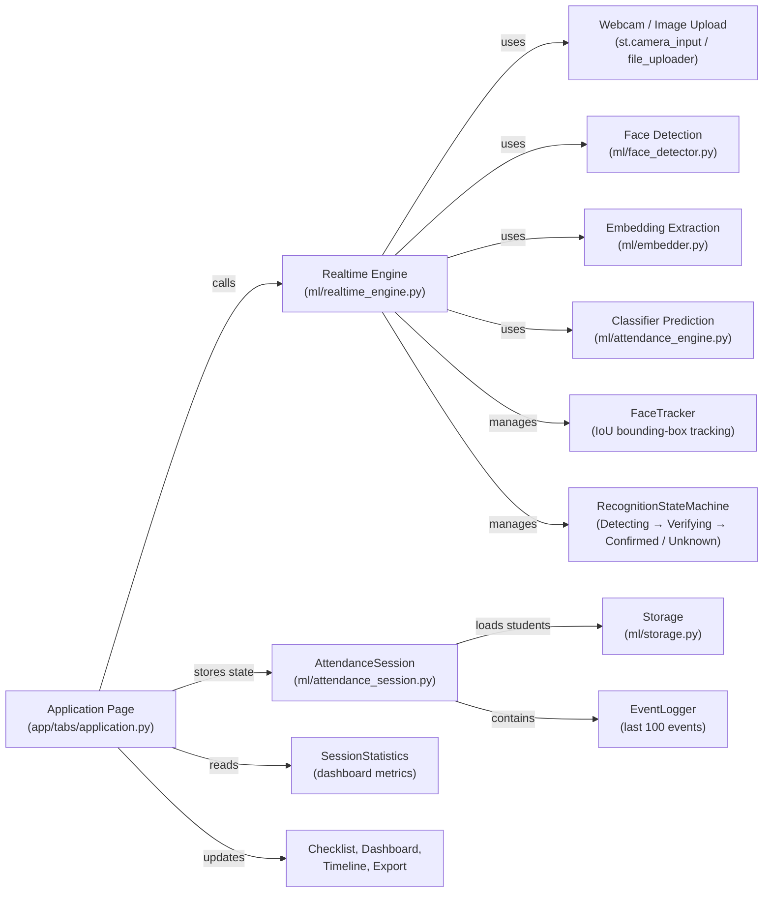
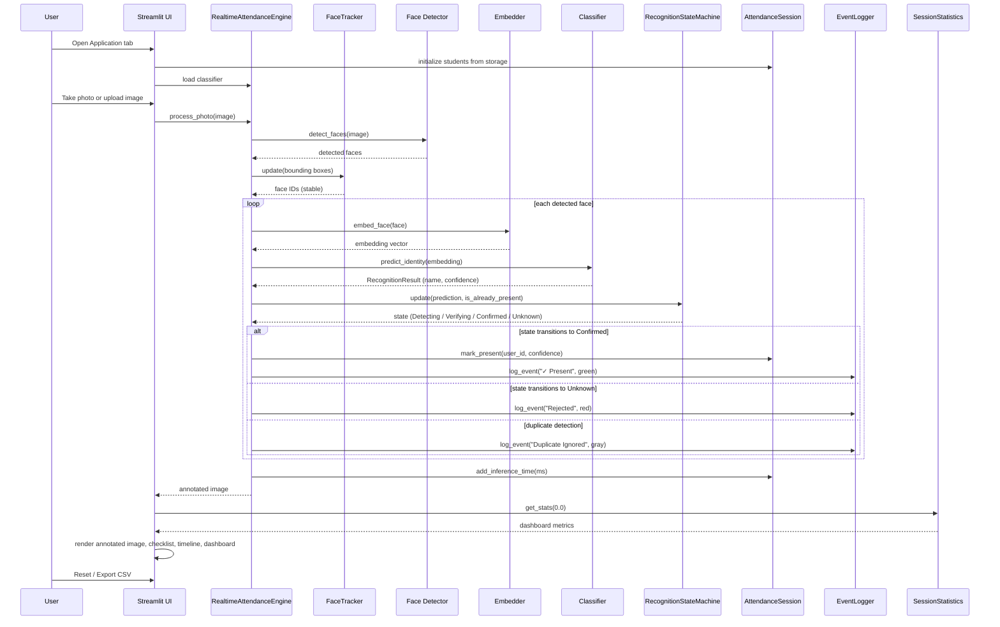

# Demo Face Recognition

Ứng dụng demo nhận diện khuôn mặt sử dụng Streamlit + InsightFace.


# ML Lifecycle Demo (Face-Recognition Attendance)

Streamlit app that walks through an end-to-end machine-learning lifecycle:

- **Data Processing** (collect → prepare → extract embeddings)
- **Model Building** (train SVM/KNN/MLP)
- **Evaluation** (metrics, confusion matrix, thresholding)
- **Deployment** (browser camera → recognition → attendance log)
- **Monitoring & Feedback** (feedback loop)

> Inspired by teachable/interactive ML demos: everything is tab-driven so you can narrate each stage while the audience clicks along.

---

## Live demo / Run locally

### 1) Install dependencies
```bash
pip install -r requirements.txt
```

### 2) Start Streamlit
```bash
streamlit run app.py
```

### 3) Pre-download InsightFace models (recommended)
On first run, the app may download weights. If you want to avoid delays during a presentation, pre-download before the demo.

---

## Using the app

1. Open the sidebar.
2. Click **🚀 Load Sample Dataset** to instantly enroll a small set of historical scientists (Ada Lovelace, Alan Turing, Grace Hopper) with a trained classifier.
3. Navigate through the lifecycle tabs using the **Lifecycle stage** radio.

### Key interactions
- **Data Collection**: register one or more people by capturing poses.
- **Data Preparation**: visualize augmentation (brightness/contrast/blur/flip).
- **Feature Extraction**: inspect the 512-D identity embedding.
- **Model Training**: train a classifier (SVM/KNN/MLP).
- **Evaluation**: explore metrics and adjust the confidence/threshold behavior.
- **Deployment**: use your browser camera to fill an attendance log.
- **Application**: experience a classroom attendance system with photo capture and upload support.
- **Reset**: **🔄 Reset demo data** to start over.

---

## Project structure

- `app.py` – Streamlit entrypoint + tab routing.
- `app/tabs/*` – UI for each lifecycle stage.
- `ml/*` – ML utilities (embedding, storage, model building, evaluation, realtime inference).
- `datasets/`, `logs/`, `models/` – runtime artifacts.

## New Application architecture



## Application sequence



---

## Testing

```bash
pytest -q
```

---

## Requirements

Python packages are listed in `requirements.txt`.

---

## Notes for presenters

See `DEMO_SCRIPT.md` for an ~8-minute narration guide with specific clicks and talking points for each tab.

