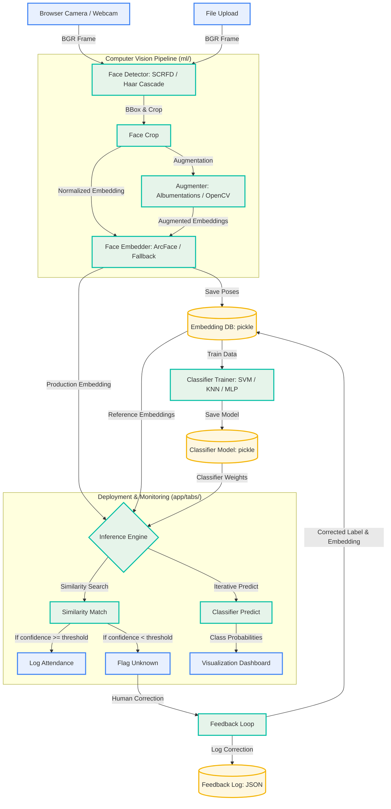

# 🧠 ML Lifecycle Demo — Face Recognition Attendance

An interactive, **Google Teachable Machine–style** Streamlit app that teaches the
**complete machine-learning lifecycle in 5–10 minutes** using a face-recognition
attendance demo.

> **Goal:** teach the lifecycle — *not* build a production attendance system.
> Priorities: **explainability, visualization, fast execution, reliability,
> educational value** over raw accuracy.

---

## ✨ What it teaches

| Tab | Stage | Lesson |
|-----|-------|--------|
| 1 | Data Processing | *"ML learns from clean features, not raw photos."* |
| 2 | Model Building | *"The model learns to draw boundaries between identities."* |
| 3 | Evaluation | *"Sometimes predicting Unknown is better than guessing."* |
| 4 | Deployment | *"This is where ML creates business value."* |

Extra demos: **dataset bias** and **data drift** simulations.

---

## 🏗️ Architecture

```
project/
├── app/
│   ├── ui_helpers.py          # Teachable-Machine theme + shared widgets
│   └── tabs/
│       ├── data_processing.py     # Tab 1
│       ├── model_building.py      # Tab 2
│       ├── evaluation.py          # Tab 3
│       └── deployment.py          # Tab 4
├── ml/
│   ├── config.py              # paths + tunable constants
│   ├── storage.py             # JSON / CSV / Pickle persistence
│   ├── insightface_app.py     # shared InsightFace singleton + availability
│   ├── face_detector.py       # InsightFace SCRFD (+ OpenCV Haar fallback)
│   ├── embedder.py            # 512-D embeddings (+ deterministic fallback)
│   ├── augmenter.py           # Albumentations (+ OpenCV fallback)
│   ├── evaluator.py           # confusion matrix + P/R/F1 + threshold sweep
│   ├── attendance_engine.py   # similarity search + attendance logging
│   └── feedback_engine.py     # human correction → DB update → improvement
├── datasets/  models/  logs/  # runtime artifacts (gitignored)
├── tests/                     # unit + integration tests
└── main.py                    # Streamlit entrypoint
```


### System Workflow



### ML Lifecycle Stage Mapping

```mermaid
graph TD
    classDef stage fill:#E8F0FE,stroke:#4285F4,stroke-width:2px;

    S1[1. Data Collection<br><i>Tab 1 (Collect)</i>] --> S2[2. Data Preparation<br><i>Tab 1 (Prep)</i>]
    S2 --> S3[3. Feature Extraction<br><i>Tab 1 (Features)</i>]
    S3 --> S4[4. Model Building<br><i>Tab 2</i>]
    S4 --> S5[5. Evaluation<br><i>Tab 3</i>]
    S5 --> S6[6. Deployment<br><i>Tab 4</i>]
    S6 -->|Re-enrollment / Retraining| S1

    class S1,S2,S3,S4,S5,S6 stage;
```

**Graceful degradation:** every heavy backend has a fallback. If InsightFace or
Albumentations can't load, the app *still runs* using OpenCV — so live demos never
hard-crash. The active backend is shown in the UI.

---


## 🚀 Installation

Requires **Python 3.10+** (tested on 3.14).

```bash
# 1. Create & activate a virtual environment
python3 -m venv myvenv
source myvenv/bin/activate          # Windows: myvenv\Scripts\activate

# 2. Install dependencies
pip install -r requirements.txt
```

> The first run downloads the InsightFace `buffalo_l` models (~300 MB) into
> `~/.insightface`. Do this **before** a live demo while you have internet.

### Run

```bash
streamlit run main.py
```

Open the URL Streamlit prints (default http://localhost:8501).

---

## 🧪 Testing

```bash
pytest -q
```

- **Unit tests** (`tests/test_unit.py`): face detection, embedding extraction,
  similarity search, PCA — backend-agnostic, safe for CI.
- **Integration tests** (`tests/test_integration.py`): registration pipeline,
  embedding DB update, attendance pipeline (known / unknown), feedback loop.

Tests use an isolated temp directory and never touch real demo data.

---

## 🎤 Demo flow

See **[`DEMO_SCRIPT.md`](DEMO_SCRIPT.md)** for a presenter-ready 8-minute walkthrough.

---

## 🔧 Tech stack

Streamlit · OpenCV · InsightFace · Albumentations · scikit-learn · Plotly ·
Matplotlib · JSON / CSV / Pickle storage.
